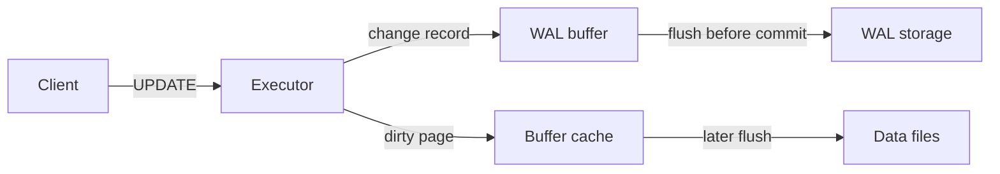

# Visual Design for Technical Articles

Use this reference to decide whether an article needs visuals and to produce `visual-plan.md`. Visuals must clarify a system, sequence, state, comparison, or decision; decoration alone is not a technical figure.

## Contents

- Decide whether a visual is warranted
- Choose the visual type and format
- Specify each figure
- Diagram rules
- AI cover rules
- Placement, accessibility, and review

## Start from reader confusion

Create a visual when prose forces the reader to hold several relationships at once, such as:

- three or more components exchanging data or control;
- a sequence with ordering, retries, or failure branches;
- state changes across a transaction or lifecycle;
- alternatives compared across several exact dimensions;
- hierarchy, ownership, or nested metadata;
- a timeline or quantitative pattern grounded in data.

Skip a visual when one sentence, a short list, or a small table is clearer. Do not target a fixed image count.

Write the reader question before choosing the format:

```text
Reader question: Which component resolves an Iceberg snapshot into data files, and where does that metadata cross the database boundary?
```

If the question is vague (`help readers understand the architecture`), the figure will probably be vague too.

## Choose the smallest useful visual

| Reader need | Visual | Preferred production format |
| --- | --- | --- |
| Components, boundaries, ownership | Architecture diagram | Mermaid for draft; SVG for publication polish |
| Ordered work or data movement | Flowchart / data-flow diagram | Mermaid or SVG |
| Messages over time | Sequence diagram | Mermaid; SVG if labels become dense |
| Lifecycle or valid transitions | State diagram | Mermaid or SVG |
| Exact option comparison | Table or comparison matrix | Markdown/HTML table; SVG only if visual grouping matters |
| Quantitative relationship | Chart | Reproducible plotting tool from source data |
| Evolution or incident order | Timeline | Mermaid or SVG |
| Article mood or metaphor | Cover / conceptual illustration | AI-generated raster image or commissioned art |

Do not use an AI-generated raster image for factual architecture, source-derived charts, code, or text-heavy diagrams. Those assets must remain editable and verifiable.

## Preserve the source boundary

- Use only components, connections, states, labels, and measurements supported by the material.
- Mark uncertain edges or labels as verification items in the plan; do not quietly render them as facts.
- Use consistent names across article, code, and figures.
- Distinguish data flow, control flow, and dependency with labels or a small legend.
- Do not imply bidirectional flow with an undirected line.
- Label illustrative numbers as examples. Never synthesize a chart from prose adjectives.
- Record the source for each quantitative visual and any transformation applied.

## Write `visual-plan.md`

Begin with a short strategy:

```markdown
# Visual Plan

## Strategy

- Article thesis: ...
- Main visual burden: ...
- Visual language: ...
- Reusable conventions: ...
```

Specify every asset with this contract:

```markdown
## Figure 1 — [Working title]

- Type: Architecture / flow / sequence / state / comparison / chart / cover
- Reader question: [The exact confusion this resolves]
- Purpose: [The conclusion the reader should reach]
- Placement: [After which paragraph or before which section]
- Source basis: [Draft section, code, data, or citation]
- Content: [Components, states, dimensions, or visual subjects]
- Relationships: [Direction, order, grouping, cardinality, branches]
- Emphasis: [One primary path or decision]
- Format: Mermaid / SVG / table / chart / raster
- Caption: [Publication-ready caption]
- Alt text: [Information-equivalent description]
- Verification: [Items an author must confirm, or “None”]
```

Add a Mermaid draft after the contract when it can faithfully express the figure. For a cover, add an image-generation brief instead.

## Design architecture and flow diagrams

- Give each figure one message. Split overview and detailed flow when both are necessary.
- Keep the primary path visually dominant; secondary systems should recede.
- Group by real boundaries: process, host, trust zone, storage layer, transaction boundary, or ownership.
- Arrange the dominant flow in one direction and avoid crossing edges.
- Put verbs on edges (`reads metadata`, `appends WAL`, `flushes page`) and nouns on nodes.
- Use short labels; move explanation into the caption or nearby prose.
- Use color redundantly with shape, line style, or labels so meaning survives grayscale and color-vision differences.
- Include a legend only when two or more encodings need explanation.
- Do not use 3D boxes, decorative gradients, or tiny icons that compete with labels.

An overview diagram should usually show roughly five to nine primary nodes. This is a cognitive guideline, not a hard limit; split the figure if labels and edges no longer scan at publication size.

## Draft with Mermaid

Mermaid is appropriate for reviewable logic and repository-native diagrams.

- Choose `flowchart`, `sequenceDiagram`, `stateDiagram-v2`, or another semantic type intentionally.
- Set a consistent direction (`LR` or `TB`) based on the article's reading flow.
- Use subgraphs only for meaningful boundaries.
- Avoid experimental syntax when portability matters.
- Keep prose labels concise and escape punctuation that breaks parsing.
- Render or validate Mermaid before delivery when the environment provides a renderer.

Example specification draft:



Use this only when the source supports the depicted sequence and labels.

## Finish with SVG when precision matters

Prefer SVG for a publication asset when the figure needs exact spacing, typography, brand styling, complex callouts, or post-generation editing.

- Keep text as selectable text when possible.
- Use a viewBox and test scaling at mobile width.
- Keep important labels readable without zoom.
- Preserve a source file and avoid embedding unsupported fonts.
- Export raster fallbacks only if the target channel requires them.

## Plan AI-generated covers safely

A cover communicates theme and mood; it must not pretend to document the system.

Include this brief:

```markdown
- Concept: [single visual metaphor grounded in the article]
- Subject: [primary object or scene]
- Composition: [focal point, depth, negative space, title-safe area]
- Style: [editorial illustration, isometric, technical collage, etc.]
- Palette: [small restrained palette]
- Exclude: legible UI, code, logos, watermarks, pseudo-technical labels, clutter
- Text: generate without text; add title in layout unless reliable typography is explicitly required
- Crop: follow the publication channel's current cover ratio and protect the focal point across crops
```

Avoid generic glowing brains, humanoid robots, random circuit boards, and impossible server rooms unless the article genuinely uses that metaphor.

## Place and caption figures

- Place a figure next to the reasoning step it supports, not in a gallery at the end.
- Introduce the question before the figure and state the takeaway after it.
- Make the caption interpret the figure rather than repeat its title.
- Number figures in reading order after the structure is stable.
- Ensure every in-text reference resolves to an actual asset or planned figure.
- Write alt text that conveys relationships and conclusions, not visual decoration alone.

## Review the complete visual system

- Does each figure answer a specific reader question?
- Is every depicted fact supported and consistently named?
- Can the main message be understood at mobile width?
- Are data, control, state, and boundaries distinguishable?
- Do caption and surrounding prose explain what to notice?
- Are colors accessible and nonessential to interpretation?
- Are source files editable and formats suitable for the channel?
- Does the cover remain conceptual rather than misleadingly technical?
- Are verification items explicit and outside the final artwork?
